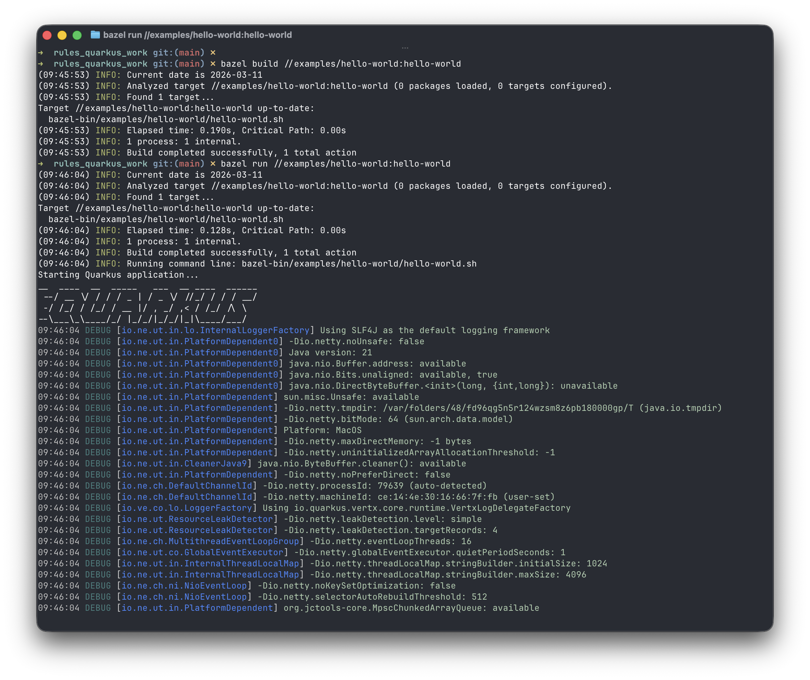

# Architecting deterministic Quarkus builds: native support for Bazel

## The convergence of divergent paradigms

Since early 2020, the Quarkus community has sought a robust integration with **[[Bazel]]** to reconcile the "Supersonic Subatomic" dynamism of the framework with the "Fast and Correct" hermeticity of the build system ([Quarkus Issue #11305](https://github.com/quarkusio/quarkus/issues/11305)).

From an architectural perspective, **[[Quarkus]]** is not merely a library; it is a sophisticated build-time engine. Its "Augmentation" phase - responsible for CDI proxy generation, bytecode indexing via Jandex, and metadata optimization - is intrinsically coupled with the Maven and Gradle lifecycles. Integrating this dynamic build-time transformation into a static, deterministic environment like Bazel represents a significant engineering challenge in infrastructure orchestration.

Today, we address this challenge with the release of `rules_quarkus`.

---

## Architectural friction: Hermeticity vs. Augmentation

The difficulty in supporting Quarkus within Bazel stems from a fundamental clash of philosophies. Bazel operates on the principles of **hermeticity** and **granularity**, requiring that every input and output be explicitly declared and immutable.

In contrast, Quarkus augmentation has traditionally functioned as a "black box" to external build tools:
1. **Classpath Scanning:** An exhaustive search of the dependency graph to identify extensions.
2. **Bytecode Transformation:** The generation of new executable code based on the application's configuration and state.
3. **Directory Structuring:** The production of a specific `quarkus-app` layout required by its specialized runtime environment.

> [!WARNING] The pitfall of legacy integration
> Prior attempts at integration often relied on `genrules` to wrap Maven execution. However, such approaches sacrifice incremental builds and remote caching—the primary advantages of adopting Bazel for large-scale Monorepos.

---

## The architectural pivot: from legacy wrapping to native integration

> [!INFO] Post-Mortem: V1 vs. V2
> Our path to the current architecture was not linear. In the initial phase (**V1**), we employed a "Legacy Wrapping" strategy, utilizing Bazel `genrules` to invoke Maven or Gradle as a sub-process. While this provided a rapid path to a functional binary, it fundamentally compromised the core tenets of the Bazel build system. The non-deterministic nature of the Maven local repository and the opaque side-effects of plugin execution resulted in frequent cache invalidations and inconsistent build outcomes.

Recognizing that a wrapper was merely a facade masking underlying complexity, we executed a strategic pivot (**V2**). We moved away from treating Quarkus as an external CLI tool and began treating it as a library of build-time primitives. By leveraging the `QuarkusBootstrap` internals, we transitioned from a "black-box" approach to a "white-box" integration, enabling us to orchestrate the augmentation lifecycle with the precision required for true hermeticity.

---

## The solution: a native integration paradigm

In developing `rules_quarkus`, we bypassed the "wrapper" pattern in favor of a native integration using the official **`QuarkusBootstrap` API**. We have restructured the build process into a **Three-layer Transformation Pipeline**:


*Figure 1: Visualizing the deterministic build-time augmentation within the Bazel sandbox.*

### 1. The compilation layer
This layer utilizes standard `java_library` targets. Source code is compiled into independent bytecode artifacts, ensuring maximum reusability and caching efficiency across the dependency graph.

### 2. The augmentation layer (`quarkus_bootstrap`)
This is the core innovation of the project. We have implemented a custom Bazel rule that:
- Aggregates the comprehensive dependency graph, distinguishing between runtime and deployment artifacts.
- Constructs an **ApplicationModel**, providing a deterministic metadata representation of the application state.
- Executes the `AugmentAction` within a sandboxed environment to generate optimized bytecode and CDI proxies.
- Produces a structured, hermetic output directory that remains consistent across build executions.

### 3. The orchestration layer (`quarkus_runner`)
To accommodate the sophisticated classloading requirements of Quarkus, we implemented a specialized runner. This component resolves required paths directly from **Bazel Runfiles**, enabling `bazel run` to operate seamlessly with the augmented application artifacts.

---

## The maturity matrix: tiered extension support

Managing the inherent complexity of the Quarkus extension ecosystem requires a disciplined approach to risk mitigation. We are introducing a **Five-Tier Support Model**:

| Tier | Category | Included Extensions |
| :--- | :--- | :--- |
| **Tier 1** | Core | Arc (CDI), REST (JAX-RS), Jackson, Vert.x |
| **Tier 2** | Data Persistence | Reactive MySQL, Oracle, Redis |
| **Tier 3** | Messaging | Kafka, RabbitMQ, gRPC |
| **Tier 4** | Observability | Prometheus Metrics, Health Checks |
| **Tier 5** | Quarkiverse | LangChain4j (AI/LLM), Experimental Integrations |

---

## What's next?

We are so excited to bring the best of both worlds together! Our goal is to make your development journey smooth, fast, and—most importantly—fun. No more wrestling with complex scripts; just clean, happy builds that stay out of your way.

Let’s build something amazing together!

### Getting started: declarative build definitions

```python
# Example BUILD.bazel configuration
load("@rules_quarkus//quarkus:defs.bzl", "quarkus_application")

quarkus_application(
    name = "enterprise-app",
    srcs = glob(["src/main/java/**/*.java"]),
    runtime_extensions = [
        "@maven//:io_quarkus_quarkus_arc",
        "@maven//:io_quarkus_quarkus_rest",
    ],
    deployment_extensions = [
        "@maven//:io_quarkus_quarkus_arc_deployment",
        "@maven//:io_quarkus_quarkus_rest_deployment",
    ],
)
```

**Supersonic, Subatomic, and now: Fast, Correct, and Scalable.**

---
*Explore the source and contribute on GitHub: [kinhluan/rules_quarkus](https://github.com/kinhluan/rules_quarkus)*
